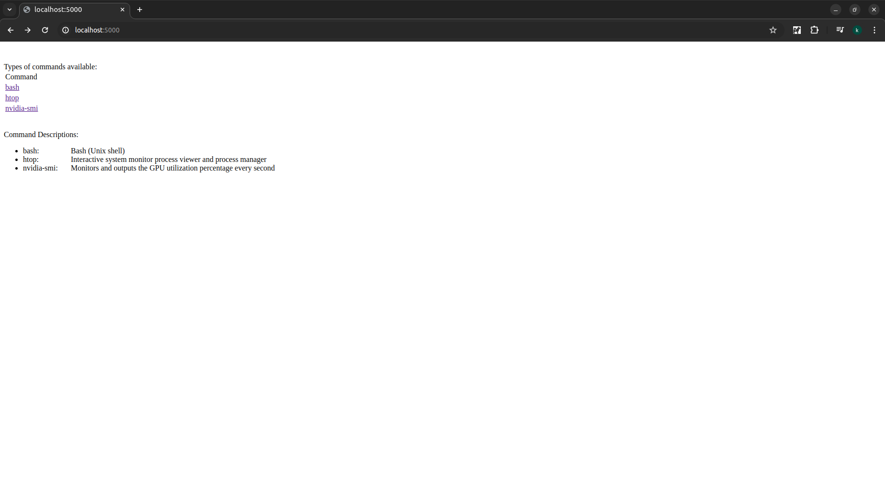
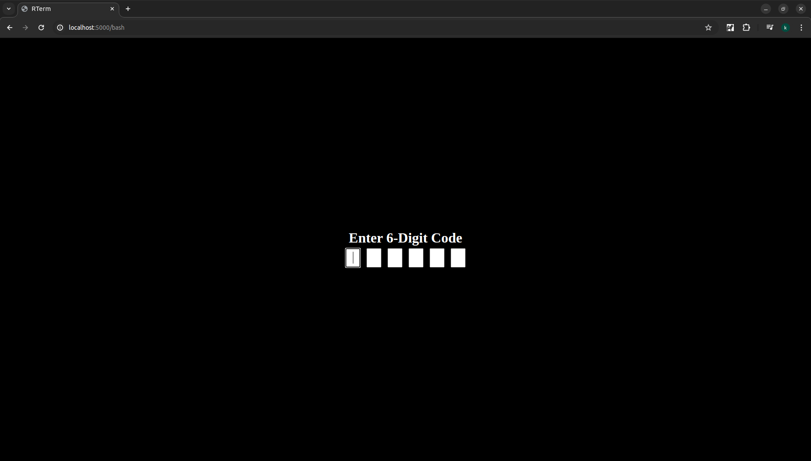

[](https://pkg.go.dev/github.com/dev6699/rterm)
[](https://goreportcard.com/report/github.com/dev6699/rterm)
[](LICENSE)

# <p align="center">RTERM</p>

RTERM is a web-based remote control application that allows you to control your terminal remotely.

Inspired by [GoTTY](https://github.com/yudai/gotty)

<p align="center">
    
</p>

## Installation

1. Import as package to existing project.

   ```bash
   go get github.com/dev6699/rterm
   ```

   ```go
   import (
       "github.com/dev6699/rterm"
       "github.com/dev6699/rterm/command"
   )

   func main() {
       rterm.SetPrefix("/")
       mux := http.NewServeMux()

       rterm.Register(
           mux,
           rterm.Command{
               Name:        "bash",
               Description: "Bash (Unix shell)",
               Writable:    true,
               AuthCheck:   auth.NewBasic("123456"),
           },
       )

       addr := ":5000"
       server := &http.Server{
           Addr:    addr,
           Handler: mux,
       }
       server.ListenAndServe()
   }
   ```

   Please check [example](cmd/rterm/main.go) for more information.

    
    

2. Prebuilt binary.

   - Grab the latest binary from the [releases](https://github.com/dev6699/rterm/releases) page.

3. From sources:
   ```bash
   # Clone the Repository
   git clone https://github.com/dev6699/rterm.git
   cd rterm

   # Build
   make build
   ```

## Usage

1. Start the binary `./rterm`.
2. Open web browser and navigate to `http://<remote_ip>:5000`.
3. Get control of your terminal!

## Features

### Embedded mode

Command pages support `?embed=1` for hosts that embed the rterm UI. In this
mode the page keeps the normal xterm.js terminal and WebSocket connection, and
notifies its parent with `postMessage` events using `{ source: "rterm" }`.
The parent may send `{ type: "write", input }`,
`authenticate`, or `resize` messages to control the session.

Embedded pages use a per-embed `bridgeToken` query parameter for parent
messaging. The page includes the token in parent events and requires it on
parent messages. Hosts should validate the message source and token before
accepting events.

Hosts must also provide a `parentOrigin` query parameter containing the exact
origin of the embedding page. Parent events are sent to that origin and
messages from other origins are rejected. This is required for Electron hosts
as well as browser hosts; do not use `*` as the target origin.

When an embedded provider page is hosted by another application, the
parent-session bridge can be limited to session discovery and tab selection.
The parent sends:

```json
{ "type": "sessions-request", "requestId": "call-1" }
{ "type": "select-session", "sessionId": "session-id" }
```

The provider page responds to a session request with metadata and the
session-scoped token needed by the trusted embedding host:

```json
{
  "source": "rterm",
  "type": "sessions-response",
  "requestId": "call-1",
  "ok": true,
  "result": [
    {
      "sessionId": "session-id",
      "token": "session-token",
      "provider": "ssh",
      "target": "node-1",
      "user": "ubuntu"
    }
  ]
}
```

The parent must validate the exact iframe origin and message source. The
embedding host decides how to retain the token and call the session HTTP
endpoints. Provider operations do not require a generic parent `tool-request`
message.

For a host that owns the WebSocket connection, use `?embed=1&bridge=parent`.
In bridge mode the rterm page renders the terminal but forwards input,
authentication, and resize messages to the parent; the parent supplies output
events as base64 data with `{ type: "output", data }`.

### Provider profiles

The example binary loads provider profiles from `rterm.json`, or from the path
specified by `RTERM_CONFIG`. Providers are generic command adapters: rterm does
not contain backend-specific connection logic. See `rterm.example.json` for a
complete profile.

#### Use cases

Provider profiles can wrap any locally installed command-line workflow, including:

- SSH/SFTP access using hosts from an inventory or the user's SSH config.
- Bastion, jump-host, or proxy commands that need a custom connection sequence.
- Cloud or infrastructure CLIs that provide authenticated shell access.
- Container and Kubernetes tools that open an interactive shell in a workload.
- Custom scripts that discover targets and delegate connection or file transfer.

The provider only defines which executable to run and how its arguments are
constructed. Authentication, certificates, keys, and provider-specific policy
remain owned by the external tool.

The discovery command may print a raw JSON array. `targetPath` and optional
`labelPath` map fields from each array item into rterm targets:

```json
[{ "hostname": "node-1", "label": "Node 1" }]
```

The profile's `users` list is the predefined list of OS users offered for
every discovered target. Commands may also return the same array under a
top-level `targets` property.

The bootstrap API is available below the configured prefix:

```text
GET  /api/providers
GET  /api/providers/{provider}/targets
POST /api/providers/{provider}/sessions
```

The provider selection page is available at `/provider`. Each configured
provider is listed there and links to its target/user selection screen, such
as `/provider/ssh`.

Creating a session returns its metadata and a random, session-scoped token:

```json
{
  "id": "session-id",
  "token": "session-token",
  "provider": "ssh",
  "target": "node-1",
  "user": "ubuntu"
}
```

The token is required for every session operation. HTTP requests use:

```text
Authorization: Bearer session-token
```

Session operations are:

```text
GET  /api/sessions/{session}/read?maxLines=200
POST /api/sessions/{session}/execute
POST /api/sessions/{session}/upload?path=/remote/file[&filename=file]
GET  /api/sessions/{session}/download?path=/remote/file
GET  /api/sessions/{session}/ws?token=session-token
```

The WebSocket query token is supported because browser WebSocket connections
cannot set arbitrary authorization headers. A session ID alone is not a
credential. The provider page may keep multiple sessions open in tabs; each
tab has its own terminal, connection, token, and transfer state.

#### Room-based shared sessions

Embedded provider pages can share session state by using the same private,
unguessable `roomId` capability:

```text
http://<host>/<prefix>/provider/<provider>?embed=1&roomId=<room-id>
```

Each page opens a room-scoped event WebSocket at
`/api/events/ws?roomId=<room-id>`. Session creation, selection, and closure
are synchronized to the other pages in that room. A newly created session is
attached to the room, and the provider page opens its own authenticated
terminal WebSocket for that session. Multiple pages therefore share the room's
session list and selected tab while retaining their own terminal connections.

The room event stream carries `new-session`, `selected`, and `closed` events.
Clients must still validate the configured parent origin for iframe messages.
The `roomId` grants access to the room's session metadata and tokens; hosts
must generate it with sufficient randomness and must not expose or reuse it
across unrelated rooms.

#### File transfers

Transfer commands use four placeholders:

```text
{target}      selected remote target, for example server-01
{user}        selected remote user, for example ubuntu
{localPath}   temporary file path on the rterm host
{remotePath}  requested file path on the remote target
```

An upload moves a browser file to the remote target. rterm first writes the
file to `{localPath}`, then runs the configured upload command:

```json
{
  "program": "scp",
  "args": ["{localPath}", "{user}@{target}:{remotePath}"]
}
```

A download moves a remote file to the browser. The provider command writes to
`{localPath}`, after which rterm streams that file to the client:

```json
{
  "program": "scp",
  "args": ["{user}@{target}:{remotePath}", "{localPath}"]
}
```

Each placeholder is passed as part of an individual process argument. Commands
are never interpreted by a shell.

For an upload destination without an extension, rterm treats the path as a
folder and appends the source filename. A destination with an extension is a
rename and must use the same extension as the source file.

## License

This project is licensed under the MIT License - see the [LICENSE](LICENSE) file for details.
