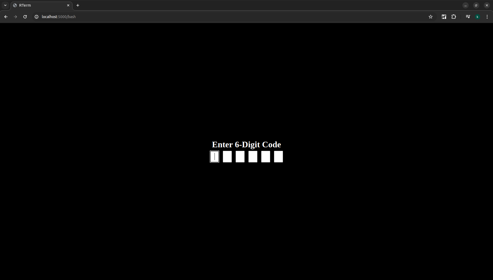

[](https://pkg.go.dev/github.com/dev6699/rterm)
[](https://goreportcard.com/report/github.com/dev6699/rterm)
[](LICENSE)

# <p align="center">RTERM</p>

RTERM is a web-based remote control application that allows you to control your terminal remotely.

Inspired by [GoTTY](https://github.com/yudai/gotty)

<p align="center">
    
</p>


## Installation

1. Import as package to existing project.
    ```bash
    go get github.com/dev6699/rterm
    ```

    ```go
    import (
        "github.com/dev6699/rterm"
        "github.com/dev6699/rterm/command"
    )

    func main() {
        rterm.SetPrefix("/")
        mux := http.NewServeMux()

        rterm.Register(
            mux,
            rterm.Command{
                Name:        "bash",
                Description: "Bash (Unix shell)",
                Writable:    true,
                AuthCheck:   auth.NewBasic("123456"),
            },
        )

        addr := ":5000"
        server := &http.Server{
            Addr:    addr,
            Handler: mux,
        }
        server.ListenAndServe()
    }
    ```
    Please check [example](cmd/rterm/main.go) for more information.

    
    

2. Prebuilt binary.

    - Grab the latest binary from the [releases](https://github.com/dev6699/rterm/releases) page.

3. From sources:
    ```bash
    # Clone the Repository
    git clone https://github.com/dev6699/rterm.git
    cd rterm

    # Build
    make build
    ```

## Usage
1. Start the binary `./rterm`.
2. Open web browser and navigate to `http://<remote_ip>:5000`.
3. Get control of your terminal!

## License
This project is licensed under the MIT License - see the [LICENSE](LICENSE) file for details.